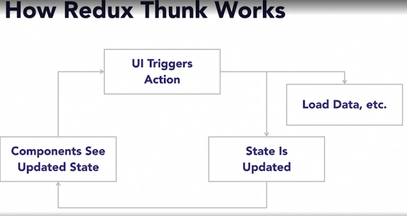
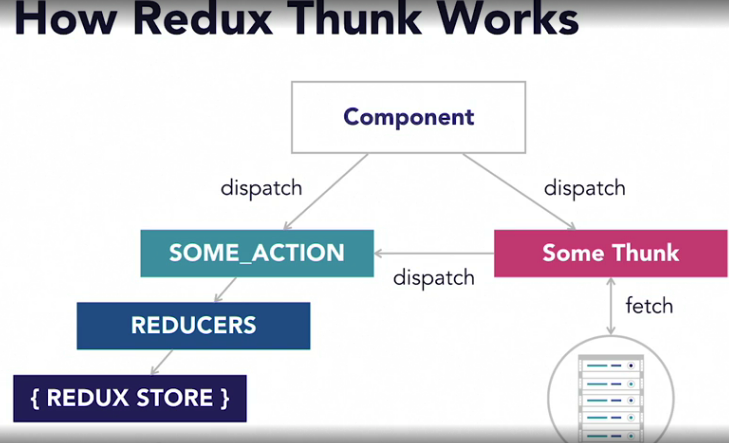
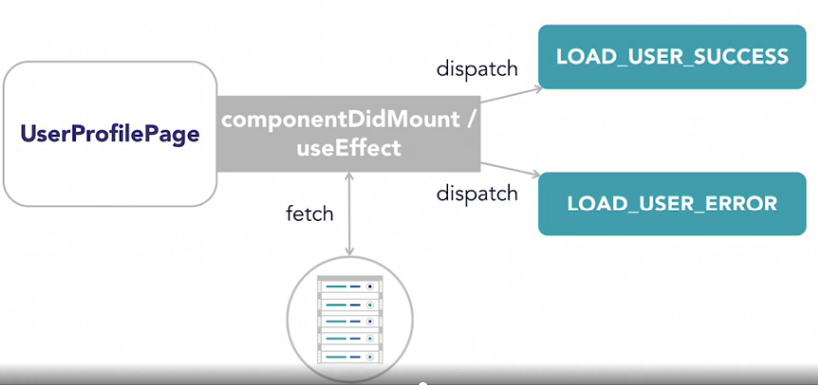

Thunk dispatch a async function instead of a javascript object.

Thunk is a function returns another function, which contains the actual logic
```
  // getState to access the current state of redux store
  export const loadTodos = () => async (dispatch, getState) => {

  }
```
## Setup 
```
  npm i redux-thunk redux-devtools-extension @babel/runtime

  npm i -D @babel/plugin-transform-runtime   # add it into .babelrc
```

##
```
import { applyMiddleware} from "redux";
import thunk from 'redux-thunk';
// devtools for middleware like thunk
import { composeWithDevTools } from 'redux-devtools-extension';

export const configureStore = () =>
  createStore(
      reducer,
      composeWithDevTools(applyMiddleware(thunk))
  );

```

thunks.js
```
```


## Reference
- [React Redux Tutorial for Beginners: Simply Explained](https://chriscourses.com/blog/redux)