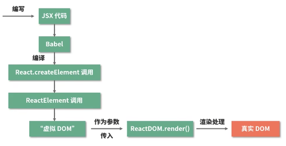

# JXS to DOM

JSX will be compiled to React Element



```js
React.createElement(type, config, children): ReactElement;
```
- go through config, get props

ReactElement is a JavaScript object, it is the virtual DOM


```js
/*
reactElement: the element will be rendered.
container: the real DOM to be the container
callback: Called after the render

*/
ReactDOM(reactElement, container, callback)
```


## Reference
- 深入浅出React【真正吃透React知识链路与底层逻辑】共23讲
